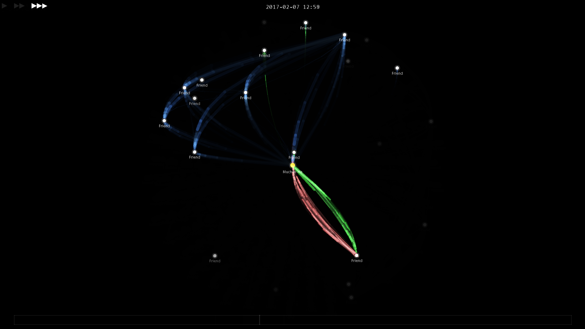

# FBVis
A Facebook Messenger chat archive visualizer. The screen is populated by nodes created based on chat and interaction history. Each node is a person; you’re at the center, and bubbles will fly from nodes to nodes based on the actual chat messages.

**Version 0.5.1 screenshot:**



## Requirements

This program can either run from the Processing IDE or executed as a standalone application. The former would require [Processing 3 or above](https://processing.org/download/). The latter requires [Java Runtime Environment](https://www.java.com/en/download/).

## How to Use

### Data Preparation

1. Go to [Facebook account settings](https://www.facebook.com/settings?tab=your_facebook_information) and *Download Your information*. 
2. Here you can select the data you want to download. For this visualizer program, we only need **Messages**.
3. Ensure that *Date Range* is **All of my data** and *format* is **JSON** and click "Create File”. Facebook will take a few hours to days to generate a .zip file. You will be notified when it’s ready.
4. Download and unzip the Facebook Messenger files into some directory.

### Setup and Configure FBVis

1. Download FBVis executable from [releases page](https://github.com/FSXAC/FBVis/releases) or clone the repository.

2. Open the configuration file under `data/config.ini` using a text editor.

3. Change the first line `data_root_path` to the path to the root of the Facebook Messenger files that we downloaded in previous section.

4. Change `master_name` to your name on Facebook exactly (important). If you’re unsure of what your name is, open `profile_information/profile_information.json` from the folder you downloaded from Facebook, and look at the first entries:

   ```json
   {
     "profile": {
       "name": {
         "full_name": "Muchen He",
         "first_name": "Muchen",
         "last_name": "He"
       },
   /* . . . truncated . . . */
   ```

5. Save the config file and done.

### Controls

Now either execute the FBVis executable or run it from the Processing IDE window. Here are the controls:

- <kbd>h</kbd> show/hide UI
- <kbd>+</kbd> increase visualization rate
- <kbd>-</kbd> decrease visualization rate
- <kbd>l</kbd> skip time
- <kbd>Esc</kbd> quit program
